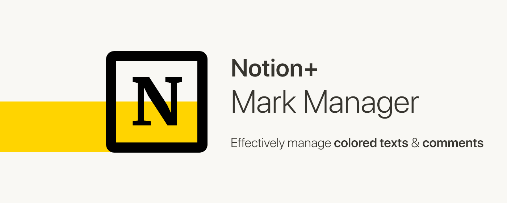
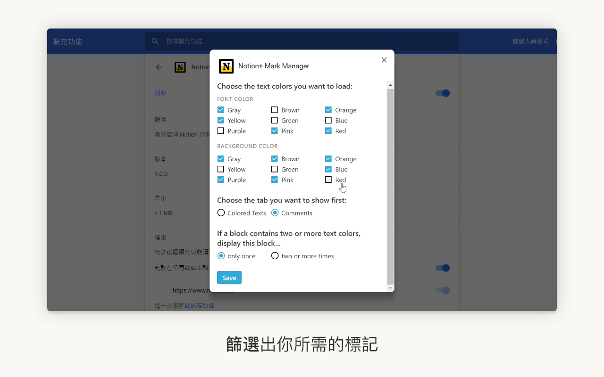
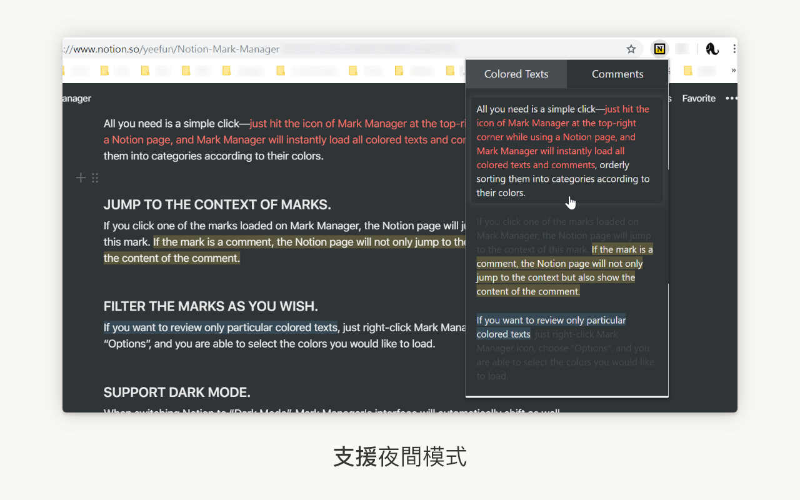

[English](https://github.com/yeefun/notion-mark-manager)

# Notion+ 標記管理器

> 高效管理 Notion 的顏色文字與註解。

（非官方插件）

[Notion](https://www.notion.so/) 的顏色文字（colored text）與註解（comment）用途多樣，能劃重點、做筆記、留言……但這些標記日後卻難以查找，只淪為畫面上的點綴。

該如何更有效率地使用並管理這些標記呢？Mark Manager，是這個問題的最佳解：

### 一次載入頁面所有標記

只需輕輕一點右上角的 Mark Manager 圖示，當前 Notion 頁面的顏色文字與註解，都會瞬間載入插件，分門別類、依序呈現，讓你快速獲知當頁所有重點與留言。

### 一鍵捲至標記所在段落

只要點擊被載入插件的顏色文字或註解，Notion 頁面便會自動捲到該標記所在的段落，讓你知道它的上下文是什麼。如果你點的是註解，頁面除了捲動，還會跳出註解上的留言──是不是很方便呢？

### 篩選出你所需的標記

你可能只想在插件中檢視某類顏色的文字──沒問題，對 Mark Manager 按下右鍵，點擊「選項」，你就可以決定哪種顏色的文字該被載入插件。

### 支援夜間模式（Dark Mode）

如果你是夜間模式的重度用戶，別擔心，Mark Manager 通通都支援！當你切換模式，Mark Manager 的介面顏色便會隨之變換，你甚至不用重新整理頁面。

現在，你可以放心地在 Notion 劃重點、做筆記或留言，不用再擔心這些標記會消失於茫茫字海中──因為 Mark Manager 會幫你找到它們。

如果你在使用上有遇到任何問題，或希望我開發新的功能，請[發 issue](https://github.com/yeefun/notion-mark-manager/issues) 或寄信給我（szyeefun@gmail.com）。
