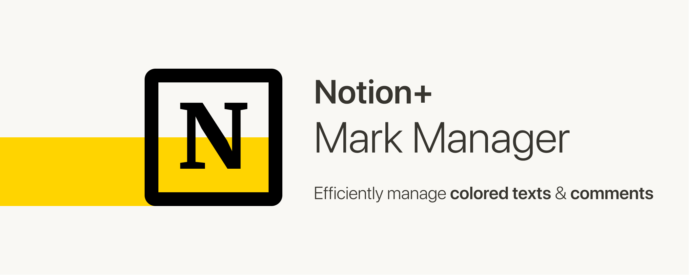

# Notion+ Mark Manager

> Manage your colored texts and comments efficiently in [Notion](https://www.notion.so/).




## Translation

- [繁體中文](./README.zh.md)

## Installation

- Get the [Chrome Extension](https://chrome.google.com/webstore/detail/notion%20-mark-manager/hipgmnlpnimedfepbfbfiaobohhffcfc) 

## Intro

[Demo Video](https://youtu.be/XRHQ2zVmziI)

Notion's colored text and comment are multifunctional tools, capable of highlighting texts, taking notes, leaving a message, etc. However, these marks are difficult to organize and file.

How to use and organize these marks more efficiently? Mark Manager is the best solution:

### IMPORT ALL MARKS WITH ONE CLICK.

All you need is a simple click. Just hit the icon of Mark Manager at the top-right corner while using a Notion page, and Mark Manager will instantly import all the colored texts and comments, orderly sorting them into categories according to their colors.

### SCROLL TO THE CONTEXT OF MARKS.

If you click one of the marks on Mark Manager, the Notion page will automatically scroll to the context of this mark. If the mark is a comment, the Notion page will not only scroll but also show the comment.

### EXPORT MULTIPLE MARKS QUICKLY.

If you want to use the marks elsewhere, don’t bother selecting, copying, and pasting them one by one—Mark Manager can help you copy or download to export multiple marks at the same time.

### FILTER THE MARKS AS YOU WISH.

If you want to review only particular colored texts, just right-click Mark Manager icon, choose “Options”, and select the colors you would like to import.

### SUPPORT DARK MODE.

When you switch Notion to “Dark Mode”, the interface of Mark Manager will automatically shift without reloading the page.

---

Now, feel free to highlight, take notes, and leave a message on Notion—Mark Manager will organize all the marks and help you find them.

## Support

To develop a free, open-source extension takes a lot of effort. **Your support** will encourage me to continue upgrading the product. There are a few things you can do:

- Tell your friends about it
- Leave a review on the [Chrome](https://chrome.google.com/webstore/detail/notion%20-mark-manager/hipgmnlpnimedfepbfbfiaobohhffcfc) store
- Give me a star on [GitHub](https://github.com/yeefun/notion-mark-manager) [](https://github.com/yeefun/notion-mark-manager/stargazers)
- Report bugs or request features via [GitHub Issues](https://github.com/yeefun/notion-mark-manager/issues/new) or this [form](https://docs.google.com/forms/d/e/1FAIpQLSdc8JGkmEpyjVbut57cd4fHMJGXEk4HITjmUGYo87f4jN-4zQ/viewform?usp=sf_link)
- [Donate me](https://pay.ecpay.com.tw/CreditPayment/ExpressCredit?MerchantID=3220361&Enn=e)

Thank you! 🙌

## Development

### Setup

After cloning the repository, install the dependencies:

```shell
npm install
```

Launch the project with:

```shell
# for Chrome
npm run dev:c

# for Firefox
npm run dev:f
```

### Build

To build the extension you have to run:

```shell
# for Chrome
npm run build:c

# for Firefox
npm run build:f
```

## License

[GPL-3.0](./LICENSE)
