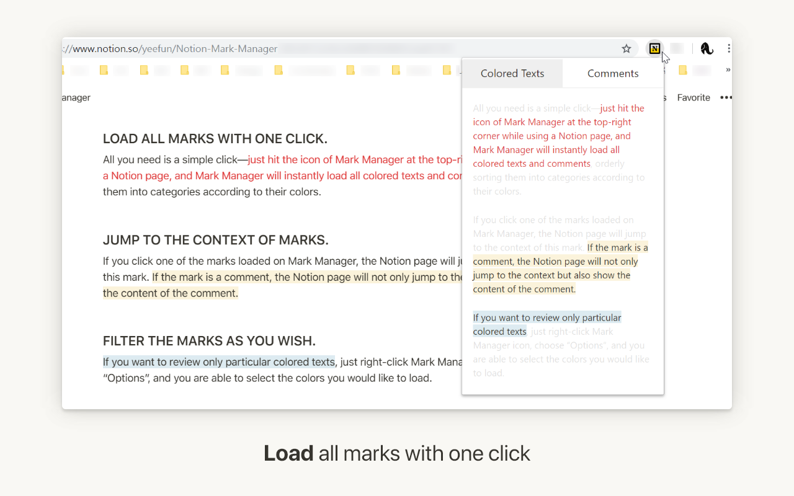
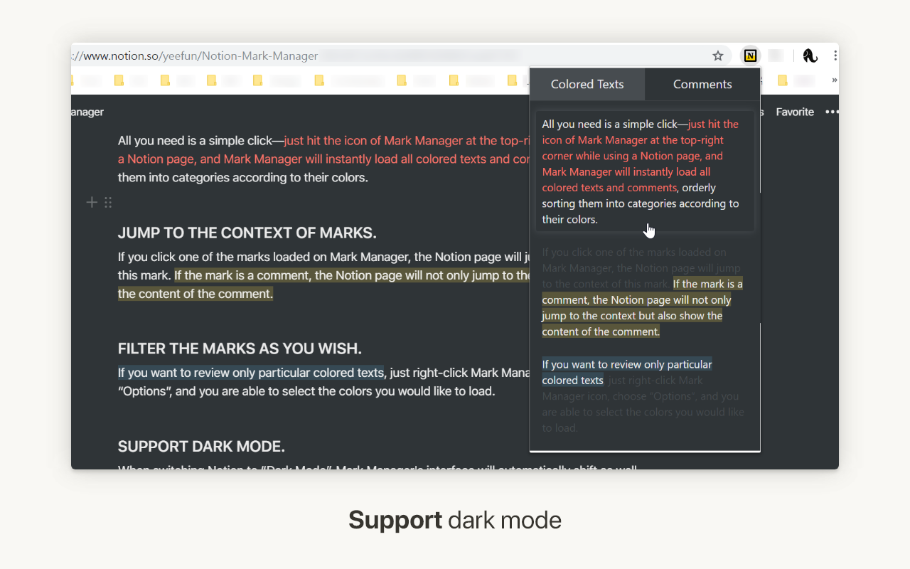

[繁體中文](./README-zh.md)

# Notion+ Mark Manager

> Manage your colored texts and comments effectively in Notion.

(UNOFFICIAL EXTENSION)

[Notion](https://www.notion.so/)'s colored text and comment are multifunctional tools, which are capable of highlighting texts, taking notes, leaving a message, etc. However, these marks are difficult to organize and file.

How to use and organize these marks more effectively? Mark Manager is the best solution:

### LOAD ALL MARKS WITH ONE CLICK.

All you need is a simple click—just hit the icon of Mark Manager at the top-right corner while using a Notion page, and Mark Manager will instantly load all colored texts and comments, orderly sorting them into categories according to their colors.

### SCROLL TO THE CONTEXT OF MARKS

If you click one of the marks loaded on Mark Manager, the Notion page will scroll to the context of this mark. If the mark is a comment, the Notion page will not only scroll but also show the content of it.

### FILTER THE MARKS AS YOU WISH.

If you want to review only particular colored texts, just right-click Mark Manager icon, choose “Options”, and you are able to select the colors you would like to load.

### SUPPORT DARK MODE.

When switching Notion to “Dark Mode”, Mark Manager's interface will automatically shift as well without reloading the page.

Now, feel free to highlight, take notes, and leave a message on Notion—Mark Manager will organize all the marks and help you find them.

If you have any questions about using Mark Manager or suggestions about developing new features, please [send an issue](https://github.com/yeefun/notion-mark-manager/issues) or email me (szyeefun@gmail.com).
